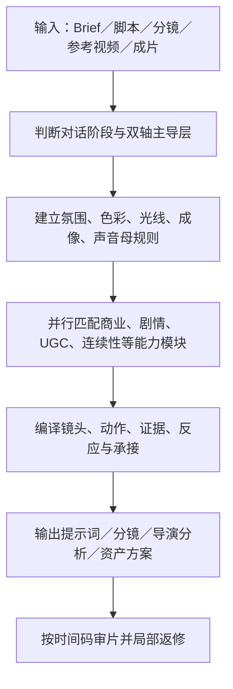

# 林枫视频提示词 Skill

> 将产品 Brief、脚本、分镜、故事板、参考视频或成片问题，转化为可直接生成的视频提示词、导演分析、分镜方案与审片返修建议。

[进入 Skill 目录](./linfeng-video-prompt/) · [查看核心规则](./linfeng-video-prompt/SKILL.md) · [查看专项能力](./linfeng-video-prompt/references/) · [查看回归测试](./linfeng-video-prompt/evaluation-cases/)

## 一句话定位

这不是单纯的“提示词润色器”，而是一套面向 AI 视频制作的导演级决策系统：先判断影片最终服务产品还是人物，再确定提示词应重点控制表演因果，还是氛围、商品体验与视觉证据；随后按任务特征并行加载适用模块，最终输出精炼、具象、可执行、便于生成和返修的视频提示词。

## 适合解决什么问题

| 任务类型 | Skill 提供的核心能力 |
| --- | --- |
| TVC／商业广告 | 从消费者决策、品牌记忆和产品证据出发，完成创意方向、导演阐述、产品进入、Hero Shot 与 End Frame |
| UGC／电商演示 | 建立真实生活动机、手机摄影逻辑、自然表演、商品操作链、同步现场声和可信即时反应 |
| 短剧／剧情／对话 | 强化人物诉求、关系、知情差、表演因果、反应、轴线、动作承接和情绪落点 |
| 写实超现实／视觉奇观 | 在可信现实中控制单一幻想规则，让微缩、巨物、产品世界化和不可能事件真正服务卖点或剧情 |
| 纪录片／真人秀／年代影像 | 把摄影者视为有限身体，建立“发现—反应—追随—恢复”的观察者摄影与年代成像真实性 |
| 多人／复杂空间／动作戏 | 管理人物站位、视线、接触拓扑、群像节奏、跨镜连续性与摄影机信息任务 |
| 旁白／口播／有声视频 | 处理旁白节奏、对白、口型、同步声、音画因果和多说话者控制 |
| 画质诊断／成片返修 | 定位模糊、噪点、过曝、脏灰、塑料皮肤、材质假、拖影、果冻、压缩与对焦漂移的主要问题层 |
| Seedance 工作流 | 支持 Seedance 2.0／2.5、关键帧、故事板、首尾帧、编辑、延长、动作参考、白模与局部重试 |

## 核心方法

### 1. 双轴创作判断

- 第一轴：成片最终服务产品／品牌，还是服务人物关系／剧情。
- 第二轴：提示词带宽由人物表演与关系因果主导，还是由氛围、商品体验与视觉证据主导。
- 混合任务必须确定一个主导层，避免把两套约束平均堆满。

### 2. 先建立全片母规则

在拆镜前统一建立氛围曲线、主色与强调色、主光来源和世界方向、肤色与产品色保护、成像触感、材质反馈及声音触感，减少跨镜漂移。

### 3. 加法式能力路由

广告、剧情、UGC、食品、美妆、群像、写实超现实、观察者摄影、声音、连续性、画质和模型工作流不是互斥分支。命中多个条件时并行加载，避免因为先进入某一种片型而漏掉其他关键规则。

### 4. 证据链与连续性

- 商品任务：初始状态 → 操作 → 接触／变化 → 完成态 → 即时反应。
- 剧情任务：事件 → 人物认知变化 → 反应 → 决定 → 关系或情绪落点。
- 所有任务持续锁定人物、商品、空间、尺寸、视线、受力、接触、声音和光源方向。

### 5. 局部返修

成片出现问题时，先识别成功层、失败层和唯一主修层；保护已经成功的内容，只修改问题层及必要的相邻承接。同一层连续失败时，再升级为多角度资产、关键帧、动作参考、故事板、白模、编辑或后期。

## 运行流程



## 可以交付什么

- 可直接复制到视频模型的完整提示词
- 分镜表、镜头时间轴和一镜到底节拍
- 导演分析、创意方向与视觉定调
- 产品广告的消费者决策与视觉证据方案
- 关键帧、故事板、白模和动作参考规划
- 旁白、对白、口型与声音设计要求
- 参考视频的导演逻辑反推与原创重构
- 成片时间码复盘、问题定位与局部重试提示词
- PPM、版本审片及团队交接建议

## 目录结构

| 路径 | 作用 |
| --- | --- |
| `linfeng-video-prompt/SKILL.md` | Skill 入口、强制原则、每次调用工作流与模块路由表 |
| `linfeng-video-prompt/agents/openai.yaml` | Skill 的名称、简介与默认调用提示 |
| `linfeng-video-prompt/references/` | 商业、UGC、剧情、摄影、连续性、画质、声音、Seedance 等专项方法 |
| `linfeng-video-prompt/evaluation-cases/` | 跨模块路由、导演逻辑、写实超现实、观察者摄影等回归测试 |
| `linfeng-video-prompt/scripts/audit_module_routing.py` | 检查引用链接、公共规则和加法式路由是否完整 |
| `linfeng-video-prompt/assets/icon.svg` | Skill 展示图标 |

## 调用示例

### 从产品 Brief 生成广告

```text
使用林枫视频提示词 Skill，根据这份产品 Brief 制作一条 30 秒面向美国市场的竖屏 TVC。先确定消费者决策与核心视觉证据，再输出可直接用于 Seedance 2.5 的视频提示词。
```

### 把脚本拆成分镜

```text
使用林枫视频提示词 Skill，把下面的剧情拆成分镜。重点控制人物关系、视线、反应、动作承接、轴线和情绪递进。
```

### 复盘生成失败的视频

```text
使用林枫视频提示词 Skill，按时间码分析这段成片。保留成功的角色、场景与光影，只定位唯一主要失败层，并输出局部重试提示词。
```

### 制作写实超现实广告

```text
使用林枫视频提示词 Skill，为这个产品设计一条写实超现实广告。奇观必须服务产品卖点，每个生成段只激活一个高权重幻想规则，并保持真实物理、比例和人物反应。
```

## 使用方式

1. 将仓库中的 `linfeng-video-prompt` 文件夹作为完整 Skill 导入支持 Skills 的账号或工作环境。
2. 保持文件夹内部结构不变，尤其不要只复制 `SKILL.md` 而遗漏 `references`、`evaluation-cases` 和脚本。
3. 在任务中直接说“使用林枫视频提示词 Skill”，并提供 Brief、脚本、分镜、参考视频、产品素材或待复盘成片。
4. 若仓库保持私有，其他账号必须拥有对应的 GitHub 访问权限；若希望通过链接让任意账号获取，需要将仓库设为公开。

## 设计原则

- 结果导向优先于表现形式：奇观、运镜和风格必须服务理解、信任、剧情或行动。
- Stable Generation First：优先保证可生成、可验证和可局部返修。
- 一镜一主任务：每个镜头只承担最关键的信息、动作或情绪变化。
- 事实与物理优先：不虚构商品尺寸、素材编号、效果证据或未经确认的信息。
- 相机运动必须有原因：等待、寻找、追随、领先、对抗、躲避、揭示或产品证明。
- 当前要求覆盖默认值：用户本轮明确约束永远优先于 Skill 的稳定默认。

## 完整性验证

当前模板包含 40 个 Skill 文件，并已通过：

- Skill 基础结构与 YAML 校验
- 31 个专项 reference 的直接路由审计
- 所有本地引用链接检查
- 公共规则与加法式模块路由检查
- 商业、剧情、写实超现实、观察者摄影、导演逻辑与画质相关回归案例

---

**Skill 名称：** `linfeng-video-prompt`  
**主要语言：** 中文，可输出中英双语或英文提示词  
**适用模型与流程：** Seedance 2.0／2.5、LibTV、MiniMax H3，以及关键帧、故事板、编辑、延长和白模等 AI 视频工作流